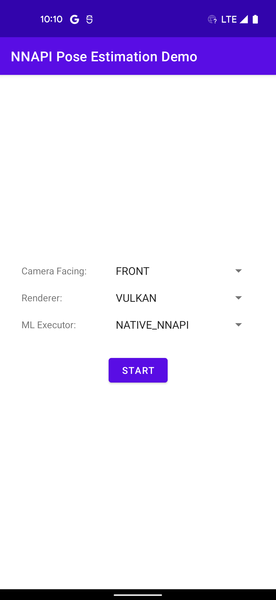

Android Neural Networks API Sample: Pose Estimation
======

Introduction
----------

Android Neural Networks API (NNAPI) Pose Estimation Sample implements a pose
estimation pipeline. We use pose estimation as a representative vision task in
machine learning that involves pipelining camera, GPU, and NNAPI workloads. The
sample app is aiming to demonstrate the best practice of running such a pipeline
on Android, focusing on optimizing the end-to-end performance and minimizing the
synchronization overhead using
[Android native hardware buffer](https://developer.android.com/ndk/reference/group/a-hardware-buffer)
and sync fence.

The sample app provides GPU implementations with both GLES and Vulkan APIs. For
simplicity, the sample app requires the device to support GLES 3.1 and Vulkan
1.1. A complete implementation should detect the GLES or Vulkan version, and
prepare a fallback path if the version requirement is not satisfied.

The sample app uses the PoseNet model from the
[TensorFlow Lite PoseNet Android Demo](https://github.com/tensorflow/examples/tree/master/lite/examples/posenet/android).

Pre-requisites
----------

- Android Studio 4.0+
- NDK r21+
- Android API 29+
- GLES 3.1+
- Vulkan 1.1+

Getting Started
----------

1. Download Android Studio.
1. Launch Android Studio.
1. Open the sample directory.
1. Click Tools/Android/Sync Project with Gradle Files.
1. Click Run/Run 'app'.

Screenshots
----------

Implementation
----------

This section highlights some important implementation details that is
demonstrated in the NNAPI Pose Estimation Sample.

### Overview

The NNAPI Pose Estimation Sample implements a pose estimation pipeline. The
overall workflow of the pipeline is:

1. Camera (`CameraBackground` thread) captures a frame and output to a
   `ImageReader` surface
1. `ImageReader` signals `PoseEstimator` that a camera frame is available
1. `PoseEstimator` (`PoseEstimator` thread) processes the camera frame
    1. Acquire the camera frame from the `ImageReader`
    1. Preprocess the camera frame with GPU
       - Colorspace transformation (YUV -> RGB)
       - Resize image to 257x257
       - Crop image to match the preview aspect ratio
       - Normalize the RGB values to 32bit floating point numbers between
         [-1.0f, 1.0f]
    1. Run PoseNet on NNAPI with GPU output
    1. Postprocess the NNAPI output on CPU to a list of keypoints
    1. Draw keypoints to a bitmap with
       [Canvas APIs](https://developer.android.com/reference/android/graphics/Canvas)
    1. Release the camera frame
    1. Invoke the result callback
1. Update UI in the result callback (main thread)

### Camera -> GPU Synchronization

The NNAPI Pose Estimation Sample demonstrates synchronizing camera and GPU
workloads using Android HardwareBuffer. The sample app creates a camera capture
session with repeated requests to a `ImageReader` surface backed by Android
HardwareBuffer. The HardwareBuffer camera frame is directly imported into GLES
or Vulkan as a sampled texture. The imported texture is cached by the
AHardwareBuffer ID
([`AHardwareBuffer_getId`](https://developer.android.com/ndk/reference/group/a-hardware-buffer#ahardwarebuffer_getid))
if the API is available.

### GPU -> NNAPI Synchronization

The NNAPI Pose Estimation Sample demonstrates interfacing GPU and NNAPI
workloads using
[Android native hardware buffer](https://developer.android.com/ndk/reference/group/a-hardware-buffer)
and sync fence.

The sample app allocates an `AHardwareBuffer` of format
`AHARDWAREBUFFER_FORMAT_BLOB` for the GPU output buffer. It is imported to GLES
or Vulkan as a GPU data buffer that is directly writable by the compute shader.
The same `AHardwareBuffer` is then imported into NNAPI with
[`ANeuralNetworksMemory_createFromAHardwareBuffer`](https://developer.android.com/ndk/reference/group/neural-networks#aneuralnetworksmemory_createfromahardwarebuffer).
Because both GPU and NNAPI drivers are able to directly access the
`AHardwareBuffer` memory, the memory copying overhead can be avoided.

The GPU and NNAPI workloads can be synchronized with Android sync fences if both
of the following conditions are met:
- The GPU driver supports exporting an Android sync fence FD signaling the end
  of a compute workload.
- NNAPI supports
  [`ANeuralNetworksExecution_startComputeWithDependencies`](https://developer.android.com/ndk/reference/group/neural-networks#aneuralnetworksexecution_startcomputewithdependencies)
  that can wait for all of the depending sync fences to be signaled before
  starting the evaluation.

Note that, although
[`ANeuralNetworksExecution_startComputeWithDependencies`](https://developer.android.com/ndk/reference/group/neural-networks#aneuralnetworksexecution_startcomputewithdependencies)
is introduced in NNAPI feature level 4 (API level 30), it is recommended to use
it starting from NNAPI feature level 5 (API level 31) because the earlier
version has some known issues in the drivers that cannot compute properly.

Using the sync fence allows the NNAPI driver to be directly signaled once the
GPU workload is completed. It has the benefit of hiding the overhead of setting
up the NNAPI execution because it is performed in parallel with the GPU
workload.

Support
----------

We highly recommend to use
[Stack Overflow](http://stackoverflow.com/questions/tagged/android)
to get help from the Andorid community.

If you've found an error in this sample, please file an issue:
https://github.com/android/neural-networks-samples

Patches are encouraged, and may be submitted by forking this project and
submitting a pull request through GitHub.
